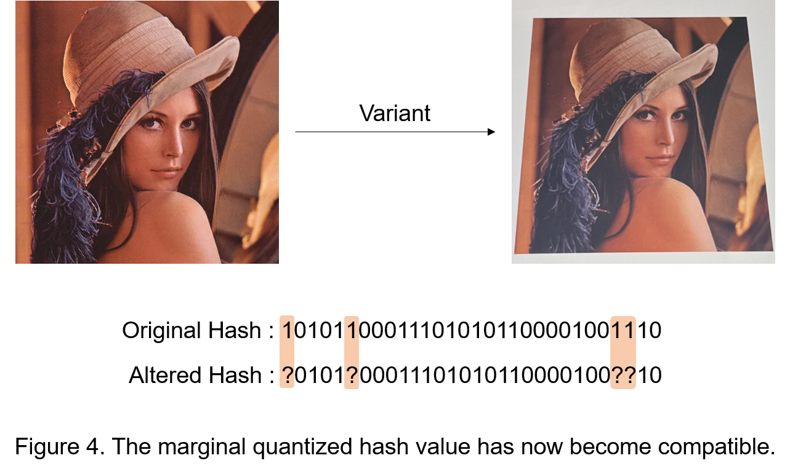

# Yet-Another-Trie-To-Hash-Image 
### Image Hashing &amp; Retrieval algorithm proposed for "Introduction to Computer Vision - SNU" term project, on June 2023

  

Most existing algorithms follow a two-step approach, where they first extract features from an image and then compare the feature vector of the input image with those stored in the database. To search the query image more efficiently, hashing techniques have traditionally been chosen as solutions. These techniques typically involve feature extraction, followed by quantization of the values, resulting in a quantized string that serves as the hash.
   

  

Hashing techniques, however, require an "exact match" between hash values, which can lead to weaknesses when dealing with certain variants, such as affine transforms and hue shifts.
   

  

In this paper, we introduce quantization margin variable, ξ, allowing values in the vicinity of 0.5 to match both 0 and 1. 
   

  

The margin makes the quantization robust to variations, ensuring that the altered hash is compatible with the original one.
   

  

Indeed, the quantized hash value can be stored and searched efficiently by "Trie" data structure. It has O(log N) time complexity in average case, and guarantees O(N) time complexity in worst case.

# Paper

**The paper is currently a WIP.**

# License

**The MIT License (MIT)**

**Copyright (c) 2023 changdae20.**
